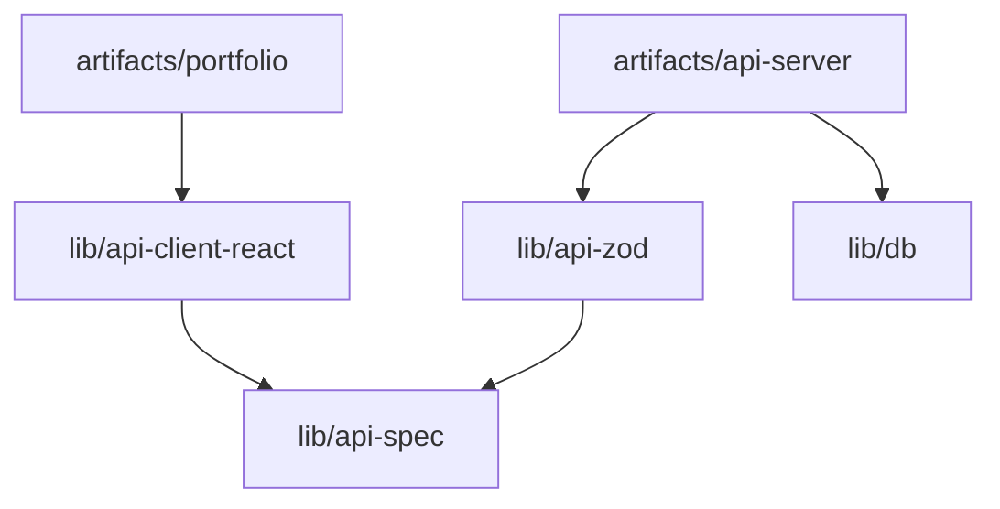

# Project Structure

This is a monorepo workspace managed with `pnpm`. The project is organized into multiple workspaces split between core libraries (`lib/`) and deployable applications/sandboxes (`artifacts/`).

---

## Workspace Map

---

## Directory Hierarchy

### 📦 Applications (`artifacts/`)
Deployable packages and sandboxes:

*   **`artifacts/portfolio/`** (Vite + React + TypeScript + Framer Motion)
    *   The primary frontend portfolio application.
    *   Includes parallax scrolling, responsive layouts, and an interactive accessibility menu (font size, contrast, reduced-motion controls).
    *   **Key Files**:
        *   `src/pages/Home.tsx`: Main portfolio page containing sections (Hero, About, Projects, Experience, Skills, Education, Contact).
        *   `src/components/ui/`: Reusable UI elements.
*   **`artifacts/api-server/`** (Express + ESBuild)
    *   Express-based backend API server deployed as a serverless function on Vercel.
    *   Contains database middleware and routing.
    *   **Key Files**:
        *   `src/index.ts`: Application entry point configured for serverless and local dev.
        *   `src/app.ts`: Express application setup with CORS, body parsers, and Pino logging.
        *   `src/routes/`: Router directories and endpoints (e.g., `health.ts` for `/healthz`).
        *   `vercel.json`: Handles catch-all routing redirecting requests to the compiled JS bundle.
*   **`artifacts/mockup-sandbox/`**
    *   A sandboxed playground environment for previewing and testing mockups.

### 📚 Libraries (`lib/`)
Shared modules and specifications:

*   **`lib/db/`** (Drizzle ORM)
    *   Manages database configuration, table schema definitions, and migration tooling.
*   **`lib/api-spec/`** (OpenAPI)
    *   Contains the core API specification defined in `openapi.yaml`. Used to generate Zod schemas and React client hooks automatically.
*   **`lib/api-zod/`** (Zod)
    *   Contains Zod validation schemas automatically generated from the OpenAPI spec.
*   **`lib/api-client-react/`** (React Query)
    *   Contains automatically generated custom hooks and fetchers based on the OpenAPI spec for frontend-backend interaction.

### 📂 Assets & Configurations
*   **`attached_assets/`**: Storage folder for static downloadable items (e.g., PDF resumes, user-uploaded profile pictures).
*   **`scripts/`**: Utility scripts for build, workspace orchestration, and typechecking.
*   **`tsconfig.base.json`**: Global base TypeScript compilation configuration.
*   **`tsconfig.json`**: Root project references.
*   **`pnpm-workspace.yaml`**: Defines the pnpm workspace configuration and security release policies.
*   **`package.json`**: Root package configurations and workspace scripts.

---

## Core Monorepo Scripts

Scripts can be run from the root directory using `pnpm`:

| Command | Action |
|---|---|
| `pnpm run build` | Builds the React frontend application (`@workspace/portfolio`). |
| `pnpm run typecheck` | Runs a workspace-wide TypeScript compilation check on all libs and artifacts. |
